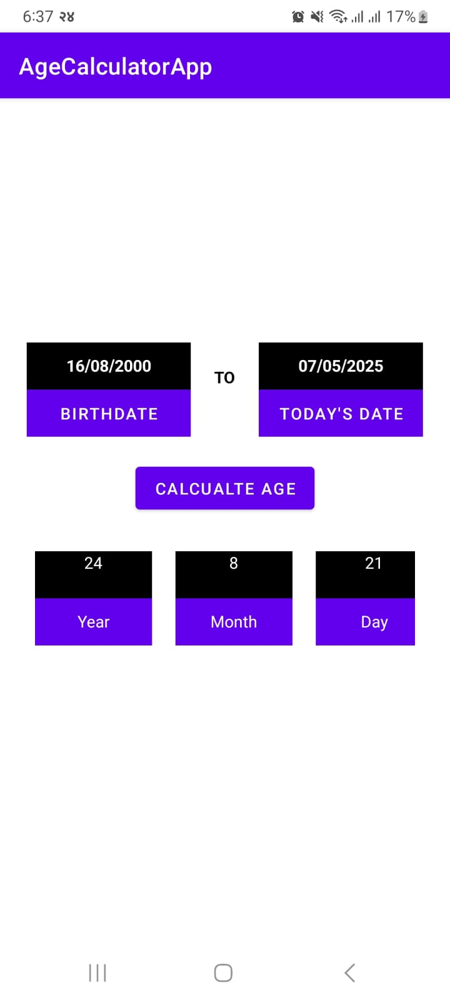
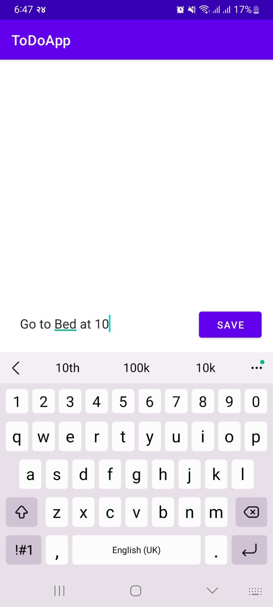
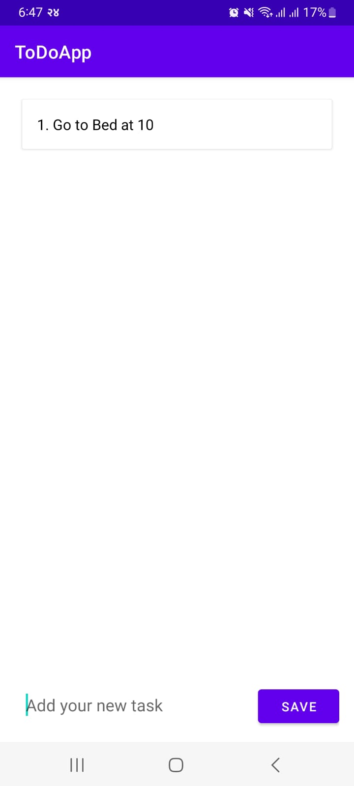
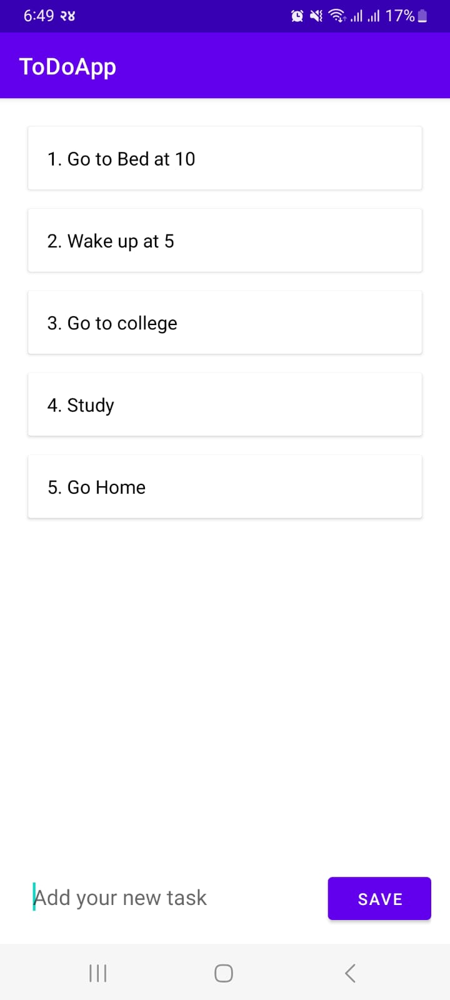
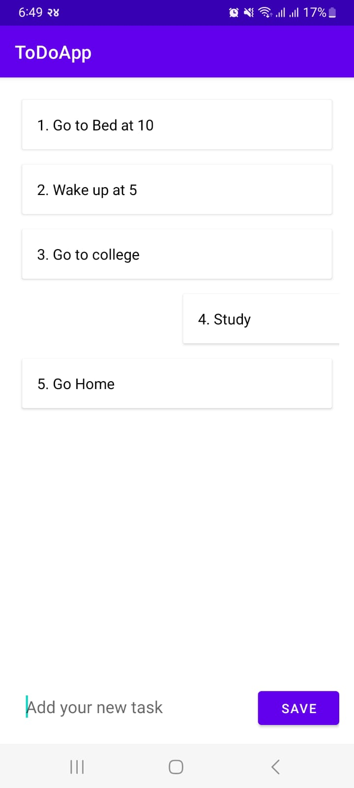
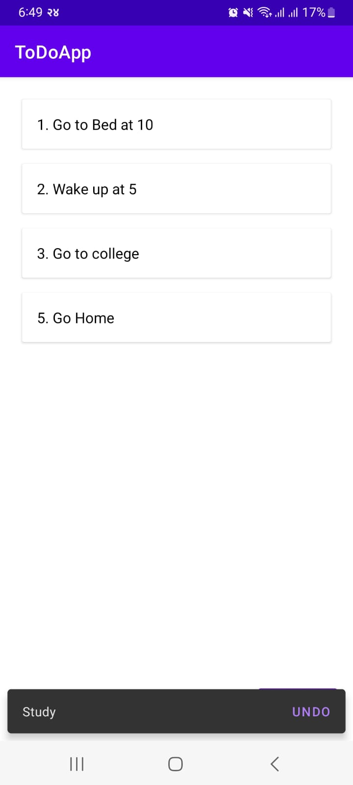

# Android Development Labs

### 📚 LAB TWO: Student Registration Form

---

### 🕰️ LAB THREE: Age Calculator

---

### ✅ LAB FOUR: TODO App
![TODO App - Main Screen]

---

> Each lab focuses on different core concepts of Android development, including user input handling, date calculations, and dynamic task management.

---

### 🚀 Key Features
- **Student Registration Form:** User-friendly input fields, form validation, and error handling.
- **Age Calculator:** Quick and accurate age calculation based on user input.
- **TODO App:** Task management with add, edit, delete, and complete functionality.

---

Feel free to adjust the image sizes directly on GitHub using the width attribute if needed:

