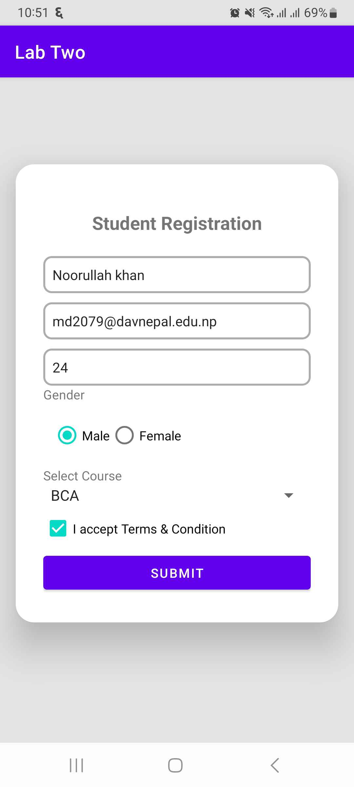

# Android Development Labs

## 📚 LAB TWO: Student Registration Form

  
  

---

## 🕰️ LAB THREE: Age Calculator

  

---

## ✅ LAB FOUR: TODO App

  
  
  
  
  
  

---

##  LAB FIVE: NEWS App

  
  

---

## 🚀 Key Features

- **Student Registration Form:** User-friendly input fields, form validation, and error handling.
- **Age Calculator:** Quick and accurate age calculation based on user input.
- **TODO App:** Task management with add, edit, delete, and complete functionality.
- **NEWS App:** Real-time news updates with keyword search, article previews, and seamless sharing options.
 
---

### 📂 How to Use

1. Clone the repository:  
git clone https://github.com/chunchunmaru12/mobile_programming.git
2. Open the project in Android Studio.
3. Run the application on an emulator or a physical device.

---

### 💡 Contribution Guidelines

- Fork the repository.
- Make changes in a new branch.
- Submit a pull request with a clear description.

---
